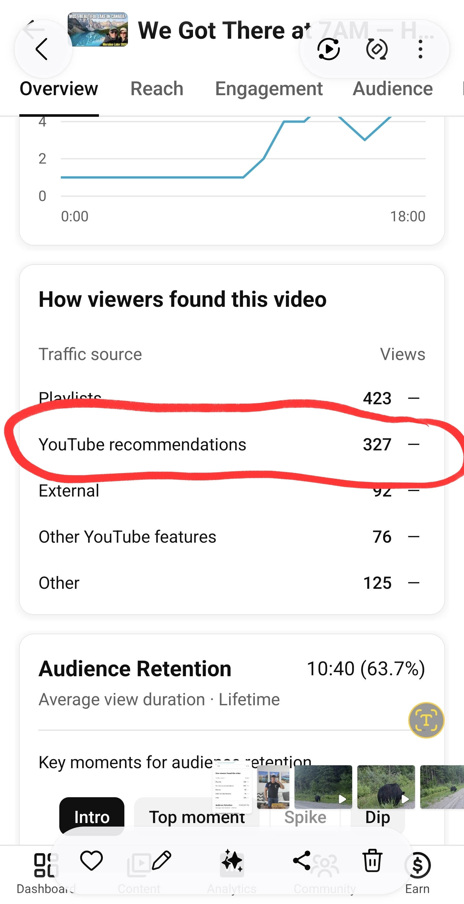

# Notes

Text sent from my phone via Claude Code shows up here.
Open this file on the laptop to read it.

---

## 2026-07-15 — Moraine Lake video getting recommended! 🎉

The "We Got There at 7AM" (Moraine Lake) video got **327 views from YouTube recommendations** — the algorithm is pushing it to new viewers on its own.

Traffic sources so far:

| Source | Views |
|---|---|
| Playlists | 423 |
| **YouTube recommendations** | **327** |
| Other | 125 |
| External | 92 |
| Other YouTube features | 76 |

Audience retention: **10:40 average view duration (63.7%)** — excellent, and likely why it's being recommended.

